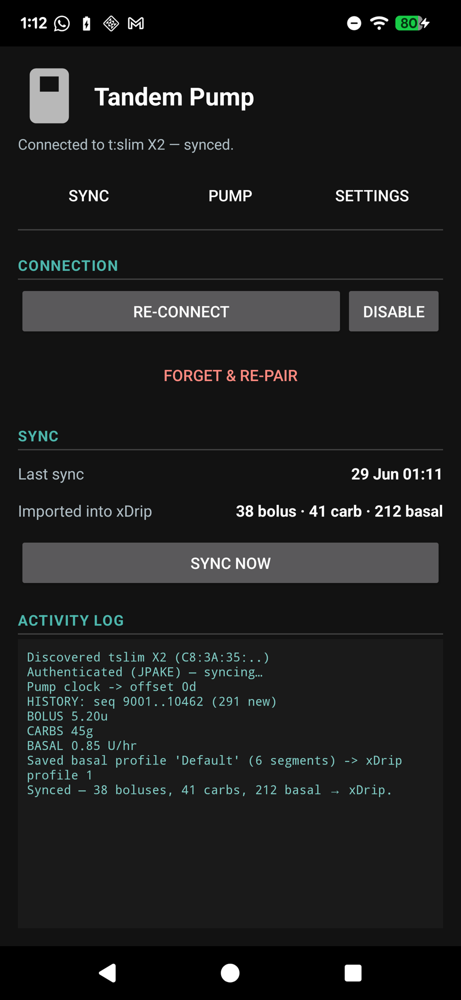
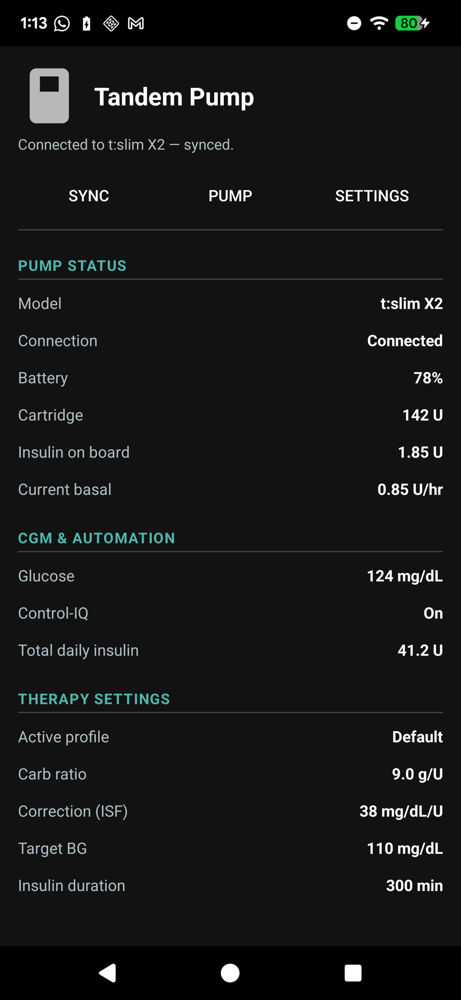
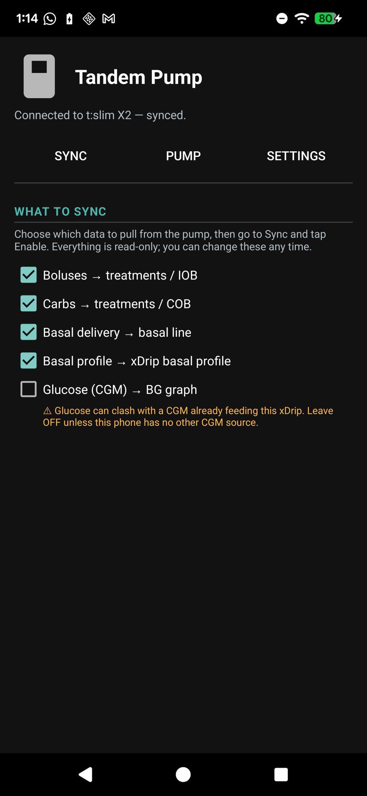
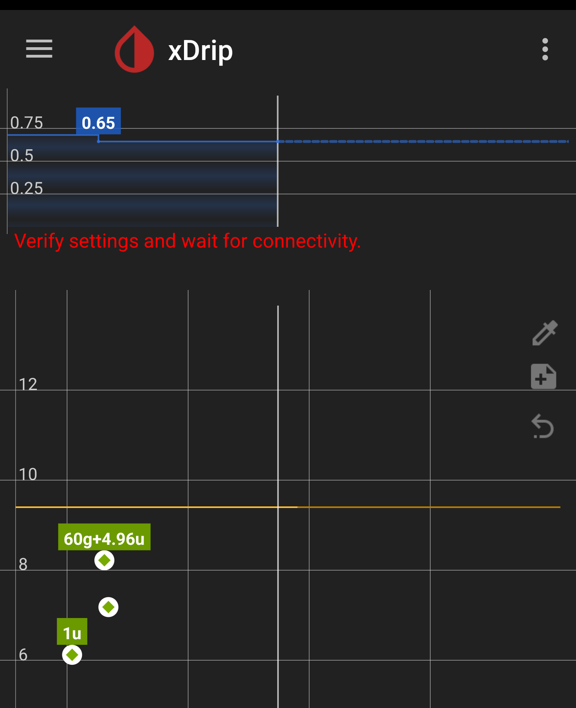

# xDrip+ for Tandem pumps — user guide

See your Tandem **t:slim X2 / Mobi** pump's **insulin, carbs and basal** inside xDrip+, straight over
Bluetooth — no cloud account, no t:connect upload. It is **read-only**: it can only *read* from the
pump and can never change anything on it.

> ⚠️ Unofficial research tool. **Not** affiliated with, approved by, or supported by Tandem or
> Dexcom. Use only with a pump you own, and never for treatment decisions.

## Features

What this adds, and how each part works (no pump changes are ever possible — see the safety note above):

- **Direct, read-only pump link.** Connects to the pump over Bluetooth (the pumpX2 protocol) and pairs
  with the pump's 6-digit code. It can only *read* — there is no path that can change a pump setting
  or deliver insulin.
- **Background sync that survives restarts.** Runs as a foreground service with an ongoing
  notification, so once enabled it keeps syncing in the background and reconnects on its own after a
  phone restart or the app being closed.
- **History import.** On connect it pulls the pump's event log — boluses, carbs and basal-rate
  changes — into xDrip's normal treatment and basal stores. It remembers how far it got, so reconnects
  only fetch what's new; the first sync pulls a recent window rather than the pump's entire history.
- **Near-real-time updates.** While connected it reacts to the pump's own change notifications (a new
  bolus, basal change or CGM reading shows within seconds) and also re-checks every 30 seconds as a
  backstop. Requests are paced so the pump's Bluetooth link is never overloaded.
- **Pick what to sync.** The Settings tab lets you opt in per data type — boluses, carbs, basal
  delivery, basal profile, glucose — so you only pull what you want. Glucose is off by default to
  avoid clashing with an existing CGM.
- **Basal mini-graph.** Basal is shown on its own small graph above the glucose chart, in real
  units/hour, with a labelled scale and the rate marked at each change. Solid is delivered basal; the
  dashed line is the upcoming scheduled profile.
- **"Now" line + shaded future.** Both graphs draw a vertical line at the current time and shade
  everything to the right (the future) in grey, so projected/scheduled data is clearly distinct from
  what has already happened.
- **Basal profile import.** Reads the pump's active basal schedule into xDrip's basal-profile editor
  and names the profile after the one on the pump.
- **Live Pump tab.** A read-only status tab shows values xDrip otherwise has no home for — battery,
  cartridge, insulin-on-board, current basal, sensor glucose + trend, Control-IQ state, total daily
  insulin, and your active carb ratio / correction (ISF) / target / insulin duration — in your
  configured glucose units.
- **Clock anchoring.** If the pump's internal clock is off, recent events are re-anchored to your
  phone's time so they land in the right place on the graph (older events keep their real time).

## What it looks like

The pump screen has three tabs — **Sync** (connect / pair / status), **Pump** (live read-only
values), and **Settings** (choose what to pull). Everything else shows on xDrip's normal screens.

| Sync | Pump | Settings |
|---|---|---|
|  |  |  |

*(Sample data shown — your real pump values appear once paired.)*

On xDrip's normal home screen, basal gets its **own mini-graph above the glucose chart** — in real
U/hr, with a labelled scale and the rate marked at each change. Solid is delivered basal; the dashed
line is the upcoming scheduled profile. A vertical **"now" line** and a **grey-shaded future** appear
on both graphs, so it's clear what has happened versus what's still ahead.

## Get the app

1. Download the latest build: this repo → **Actions** tab → newest **Build Tandem APK** run →
   **Artifacts** → **`xdrip-tandem-fastDebug-apk`** → unzip to get **`app-fast-debug.apk`**.
2. Copy it to your phone and tap it to install (allow "install unknown apps" if prompted).
   - Builds are now signed with a **stable key**, so newer builds **update in place** and keep your
     pairing. (Coming from an older build from before this change? Uninstall it once, then future
     updates install cleanly.)

## Set up & pair

1. **In xDrip:** ☰ menu → **Settings → Experimental → "Tandem pump (read-only)"**.
2. **Settings tab:** tick what you want to pull — **Boluses, Carbs, Basal delivery, Basal profile**.
   Leave **Glucose (CGM)** *off* unless this phone has no other CGM feeding xDrip (it would clash).
3. **On the pump:** Settings → Bluetooth → **Pair Device** — keep it on the screen showing the
   **6-digit code**.
4. **Close / log out of the official t:connect app** (only one app can use the pump's Bluetooth).
5. **Sync tab:** tap **Enable & Sync**, allow the Bluetooth / Location permission.
6. **Accept the Android "Bluetooth pairing request"** (if no dialog pops, swipe down the
   **notification shade** — it's often there).
7. When xDrip shows the **code box**, type the **6-digit code from the pump** and tap **Pair**.

It then keeps syncing **in the background and after restarts** — you don't re-enter the code. Use
**Sync now** any time to force a refresh.

## Where your data shows up

Everything lands on the **normal xDrip screens** — the tabs are just for setup/status:

- **Boluses** and **carbs** → main graph + treatments list, and drive **IOB / COB**.
- **Basal** → its own **mini-graph above the glucose chart**, in real U/hr, showing both delivered
  basal and the upcoming scheduled profile (dashed). Turn the basal line on under **Settings → Graph
  Settings → "Show Basal TBR"** if you don't see it.
- **Glucose** (only if you ticked it) → the BG graph.

While the pump is connected it updates close to **real time**: it reacts to the pump's own change
notifications and also re-checks every 30 seconds, so new boluses, basal changes and CGM readings
appear within seconds rather than only on a manual sync.

The **Pump** tab shows live read-only extras that xDrip has no home for — model, battery, cartridge,
insulin-on-board, current basal, sensor glucose, Control-IQ state, total daily insulin, and your
active carb ratio / correction (ISF) / target / insulin duration.

## Changes to existing xDrip behaviour

Beyond adding the Tandem screen, this build changes a few things you may already know:

- **Basal is drawn on its own graph**, not as a temp-basal percentage on the glucose axis. It reads in
  real units/hour and a basal rate no longer appears up near a glucose value. The
  **Settings → Graph Settings → "Show Basal TBR"** toggle still controls whether basal shows.
- **The glucose chart gained a "now" line and a grey-shaded future region** — for everyone on this
  build, not only Tandem users (a general graph-readability change).
- **The default chart view extends a couple of hours into the future** so the next scheduled basal
  change (and near-future IOB/COB) is visible, while keeping "now" on screen.
- **The basal-profile editor can name profiles** — rename one yourself, or the name is set
  automatically when a profile is imported from the pump.
- **Minimum Android version is now 8.0 (API 26)**, up from 7.0 — the pump's Bluetooth library requires
  it, so phones on Android 7 can no longer install this build. (The app still *targets* the older API
  on purpose, to keep background collection reliable.)
- **Pump values are units-aware** — glucose, ISF and target on the Pump tab show in whatever units
  xDrip is set to (mg/dL or mmol/L).

## Tips & troubleshooting

- **No pairing prompt** — check the **notification shade** for a "Bluetooth pairing request". If
  there's nothing, tap **Forget & re-pair** (clears a stale bond), put the pump back in *Pair
  Device*, and **Enable & Sync** again.
- **"Pump rejected the pairing code"** — re-open *Pair Device* on the pump for a fresh code, make
  sure t:connect is closed, and if it persists tap **Forget & re-pair** and retry.
- **Data isn't on the graph** — it's plotted at the **pump's own event times**. If your pump's clock
  is wrong the app re-anchors recent data to your phone's time; older events (e.g. a bolus from days
  ago) sit back at their real time — scroll/zoom the graph back to find them.
- **"Built for an older version of Android"** on launch — a harmless notice (xDrip targets an older
  SDK on purpose for reliable background operation). Tap **OK**.
- **Stuck on "Scanning…"** — check Bluetooth + Location are on, permission granted, and the pump is
  in *Pair Device* mode and nearby. A pump talks to only **one** app at a time.

## Status

Built and verified end-to-end on a **Pixel / Android 16**: pairs (JPAKE, 6-digit code), stays
connected, and imports boluses / carbs / basal into xDrip's native stores. Live pump values render on
the Pump tab.

---

*Developers: architecture, data mapping, dependencies and build instructions are in
**[TANDEM_TECHNICAL.md](TANDEM_TECHNICAL.md)**.*
