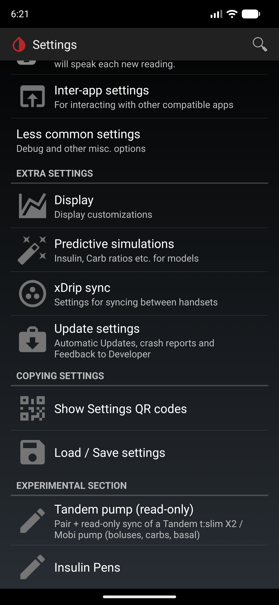
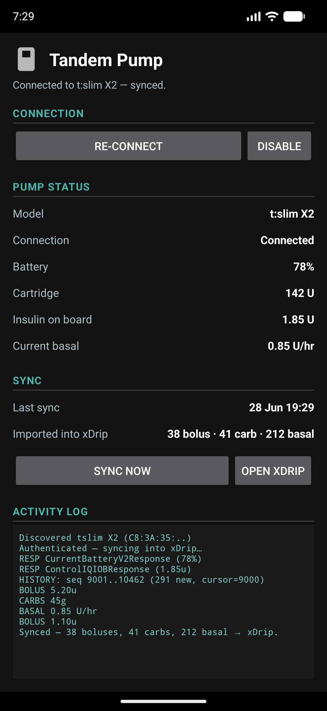

# xDrip+ for Tandem pumps — user guide

See your Tandem **t:slim X2 / Mobi** pump's **insulin, carbs and basal** inside xDrip+, straight over
Bluetooth — no cloud account, no t:connect upload. It is **read-only**: it can only *read* from the
pump and can never change anything on it.

> ⚠️ Unofficial research tool. **Not** affiliated with, approved by, or supported by Tandem or
> Dexcom. Use only with a pump you own, and never for treatment decisions.

## What it looks like

| Find it under Settings → Experimental | The pump screen |
|---|---|
|  |  |

*(Sample data shown — your real pump values appear once paired.)*

## Get the app

1. Download the latest build: this repo → **Actions** tab → newest **Build Tandem APK** run →
   **Artifacts** → **`xdrip-tandem-fastDebug-apk`** → unzip to get **`app-fast-debug.apk`**.
2. Copy it to your phone and tap it to install (allow "install unknown apps" if prompted).
   - If you already had a previous build installed, **uninstall that first** — each build is signed
     with a different key, so an in-place update is rejected.

## Pair your pump

1. **On the pump:** Settings → Bluetooth → **Pair Device** — it shows a pairing code.
2. **Close / log out of the official t:connect app** (only one app can use the pump's Bluetooth at a time).
3. **In xDrip:** ☰ menu → **Settings → Experimental → "Tandem pump (read-only)"**.
4. Tap **Enable & Sync** and allow the Bluetooth / Location permission.
5. Accept the Android pairing prompt, then type the **code shown on the pump** and tap **Pair**.

That's it. It then keeps syncing **in the background and after restarts** — you don't re-enter the code.
Use **Sync now** any time to force a refresh.

## Where your data shows up

Everything lands on the **normal xDrip screens** — there are no extra screens to learn:

- **Boluses** and **carbs** → on the main graph and treatments list, and drive **IOB / COB**.
- **Basal** → the basal line / basal chart. *(If you don't see it, turn the basal line on in xDrip
  settings — it's off by default.)*

The **"Tandem pump"** screen itself only shows **pairing** and **pump status** — model, battery,
cartridge units, insulin-on-board, current basal, last sync, and a small activity log. To get back to
your data, just press **Back**.

## Tips & troubleshooting

- **"This app was built for an older version of Android"** on launch — a harmless Android notice
  (xDrip targets an older SDK on purpose for reliable background operation). Tap **OK**.
- **xDrip "Update available" popup** — that's xDrip's own updater, unrelated to this fork; close it
  (or disable update checks in xDrip settings).
- **"Pump rejected the pairing code"** — re-open *Pair Device* on the pump for a fresh code, make
  sure t:connect is fully closed, and if it persists, unpair the pump in Android Bluetooth settings
  and try again.
- **Stuck on "Scanning…"** — check Bluetooth and Location are on, the permission was granted, and the
  pump is in *Pair Device* mode and nearby.
- A pump can only be actively connected to **one** app at a time.

## Status

Built and verified to install and run on **Android 17 (Pixel)**. Live pump pairing requires a real
phone with Bluetooth (it can't be exercised on an emulator).

---

*Developers: architecture, data mapping, dependencies and build instructions are in
**[TANDEM_TECHNICAL.md](TANDEM_TECHNICAL.md)**.*
